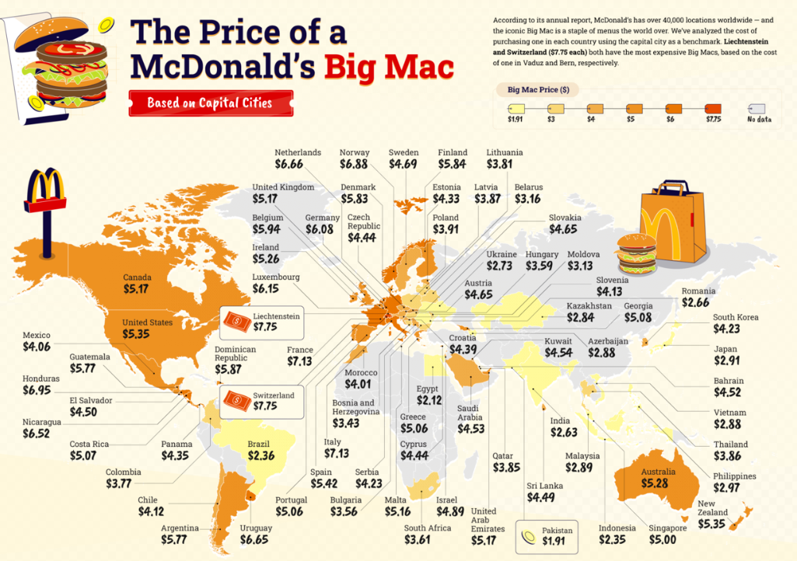
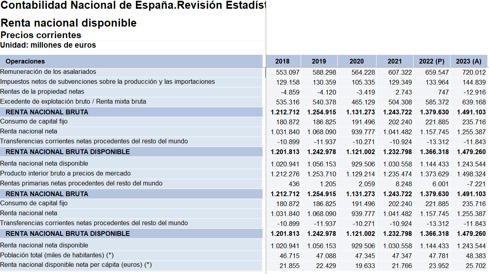
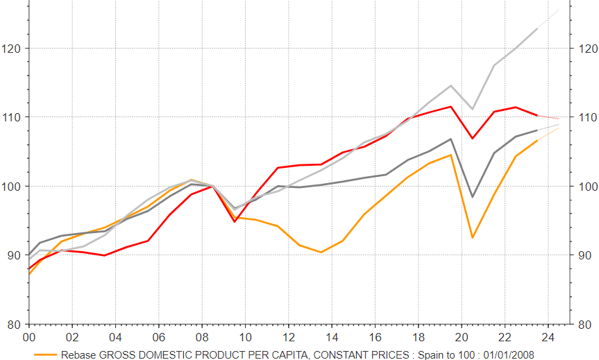
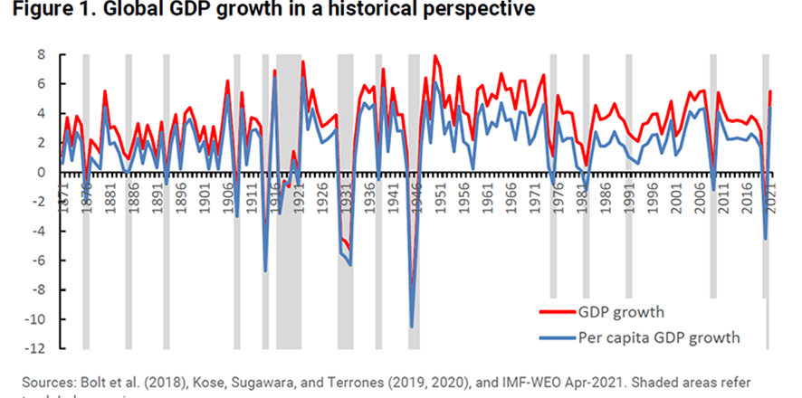
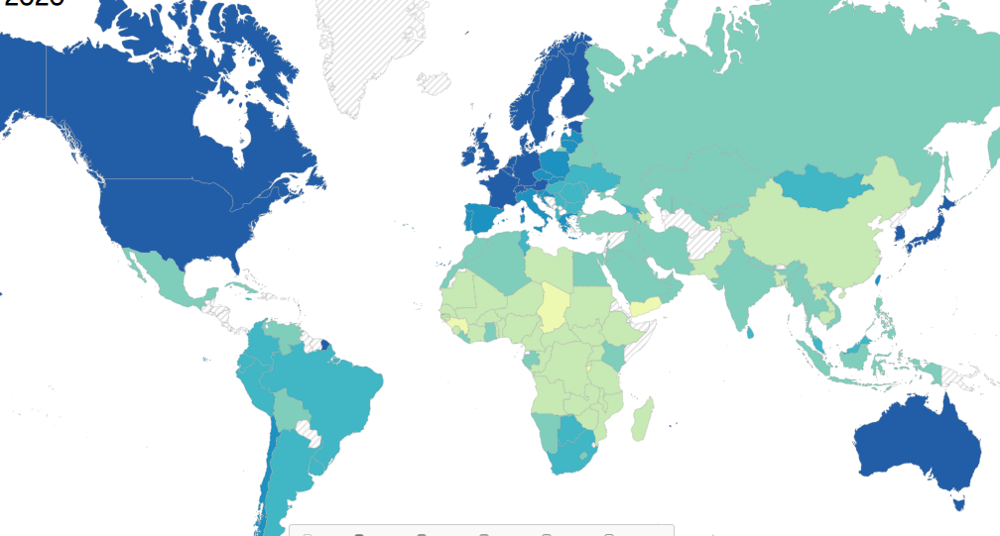

## Theory
Gross Domestic Product (GDP) is the total monetary or market value/prices of all the finished goods and services (final G&S) produced within a country's borders in a specific time period.

3 valuation criteria: 

• Basic Prices: The basic price of a product represents the value at which it leaves the economic unit that produces it, including taxes and subsidies related to production. It is equivalent to the sum of factor remuneration and other net production taxes (taxes minus subsidies). If these taxes/subsidies were excluded, the valuation would revert to the outdated concept of "factor cost", which is no longer used in current accounting standards. 

• Producer prices: values at basic prices plus the taxes (net of subsidies) on products and imports, with the exception of VAT. It corresponds to the old ex-factory price valuation criterion. 

• Acquisition prices / market prices: prices paid by consumers.

GDP – Three approaches: Sum of Spending, Factor Incomes or Output

<figure>
  <iframe src="/assets/HTML/1_1_Approaches1.html" style="width:90%;height:420px;" loading="lazy"></iframe>
  <iframe src="/assets/HTML/1_1_Approaches2.html" style="width:90%;height:150px;" loading="lazy"></iframe>
  <figcaption>GDP – Three approaches: Sum of Spending, Factor Incomes or Output
  
  Source INE and own ellaborations (updated on 2025, Feb. from https://www.ine.es/jaxiT3/Tabla.htm?t=67821&L=0
</figcaption>
</figure>

<iframe src="/assets/HTML/1_1_Deprec.html" style="width:100%;height:500px;" loading="lazy"></iframe>

GNP = GDP + NPI

NNP = GNP – FCC

GNP = GNI

NNP = NNI

NNDI = NNP + NT
 
GDP = GNP - NPI = NNP + FCC – NPI = NNI + FCC – NPI = NNDI - NT + FCC – NPI

NNDI = GDP + NT - FCC + NPI

GNDI = GDP + NT + NPI
 
RNBD
Disposable Net Domestic Rents – Final consumption = Gross Domestic Savings
 
GNDI = GNS + FCE
NNPMP  - Taxes + subsides = NNPfc = National income
 
GDPMP – CCF= NDPMP

GNPMP – CCF = NNPMP
A developing country: GDP usually greater than GNP

GDP per cápita = GDP / Population

Productivity = GDP / Workers

<iframe src="/assets/HTML/1_1_GDP_Rank.html" style="width:110%;height:670px;" loading="lazy"></iframe>

Gross national product (GNP) is an estimate of total value of all the final products and services turned out in a given period by the means of production owned by a country's residents. 
 
Comment: flow variable (is measured with reference to a period of time) and stock variable (particular point of time) variables.

<iframe src="/assets/HTML/1_1_Flow_Stock.html" style="width:110%;height:300px;" loading="lazy"></iframe>

## Growth meassures

### Growth Rate Formula

The growth rate of \(V_t\) is given by:

$$
GR_{V_t} = \frac{V_t - V_{t-1}}{V_{t-1}} \times 100
$$

### Compound Growth Rate Formula

The \(Compound\ Growth\ Rate\ (CGR)\) is calculated using the formula:

$$
CGR = \left( \frac{V_{t+n}}{V_t} \right)^{\frac{1}{n}} - 1
$$

#### The Rule of 70: Doubling Time

The \(Rule\ of\ 70\) estimates the number of years required for a quantity to double, given a constant growth rate:

$$
Doubling\ Time = \frac{70}{Growth\ Rate}
$$

#### Example Calculation

If an economy grows at 5% per year, the time it takes to double is:

$$
Doubling\ Time = \frac{70}{5} = 14\ years
$$

## Index Number Formula

The \(Index\ Number\) is calculated using the formula:

$$
Index\ Number = \frac{Variable\ in\ t}{Variable\ in\ Base\ Year} \times 100
$$

## Deflator Formula

The **Deflator** is calculated using the formula:

$$
Deflator = \frac{Nominal\ Value}{Real\ Value} \times 100
$$

### Explanation

- \(Nominal\ Value\) = measured at current prices.
- \(Real\ Value\) = measured at constant prices.

<iframe src="/assets/HTML/1_1_P_index.html" style="width:110%;height:300px;" loading="lazy"></iframe>

## Exchange Rate Formula

The \(Exchange\ Rate\) represents the amount of national currency required to obtain \(one\ unit\) of a foreign currency:

$$
Exchange\ Rate = \frac{Units\ of\ National\ Currency}{One\ Unit\ of\ Foreign\ Currency}
$$

### Explanation

- \(Units\ of\ National\ Currency\) = the amount of local currency needed.
- \(One\ Unit\ of\ Foreign\ Currency\) = the reference foreign currency (e.g., 1 USD, 1 EUR).

### Example Calculation

If 1 USD is equal to 20 Mexican Pesos (MXN), then:

$$
Exchange\ Rate = \frac{20\ MXN}{1\ USD} = 20
$$

This means 1 USD is worth 20 MXN.

{ width="50%" }

  
  

### Interventions in exchange rate markets.

Depreciation: A currency loses value relative to a foreign currency. This means more units of the national currency are needed to purchase one unit of the foreign currency.
Appreciation: A currency gains value relative to a foreign currency. This means fewer units of the national currency are needed to purchase one unit of the foreign currency.
Devaluation & Revaluation for fixed exchange regimenes

PPP
Developing countries use to have “cheaper” noncommercial services.
Comparisons with exchange rate tend to underestimate the purchasing power capacity  ➡️Purchasing Power Parity – Big Mac Index. 

Efective exchange rate (nominal & real): weighted average of the bilateral exchange rates between the home country and its major trading partners. 

Effective exchange rates - data | BIS Data Portal https://data.bis.org/topics/EER/data?pdqId=BIS%2CPDQ_I2_B%2C1.0&data_view=table&filter=FREQ%3DM%255EEER_BASKET%3DB%255EEER_TYPE%3DR%255ELAST_N_PERIODS%3D10&rows=REF_AREA&cols=TIME_PERIOD&settings=asc%7Cdesc%7Cname

## Alternative meassures of economic activity
Limitations of the GDP measure:

1.- Effects on stock variables (e.g. deforestation, petrol stocks...)

2.- Type of production (education vs. military spending or hospitals vs. crime)

3.- Environmental costs Negative externalities (pollution)

4.- Production for the market only: informal economy  

5.- Distribution problems

6.- Measurement vs. reality (statistical discrepancies)

Index of Sustainable Economic Welfare / Índice de bienestar económico sostenible

$$
IBES = \left( \tilde{C}_P + \tilde{C}_C - C_{PS} - C_{CS} \right) + I + P_D - \left( \delta_A + \delta_{NK} \right)
$$

<iframe src="/assets/HTML/1_1_Sust.html" style="width:100%;height:450px;" loading="lazy"></iframe>

- [Index_of_Sustainable_Economic_Welfare](https://en.wikipedia.org/wiki/Index_of_Sustainable_Economic_Welfare)

- [Better life index](https://stats.oecd.org/Index.aspx?DataSetCode=BLI)
https://stats.oecd.org/Index.aspx?DataSetCode=BLI

## Inequality

  
  

[Visualizing global income inequality](https://www.core-econ.org/inequality-skyscrapers/) 
[Visualizing global wealth inequality](https://tzvetanmoev.github.io/core-skyscraper-2-wealth/html/fig_1995.html)

{ width="50%" }

[Aumented Human Development Index](https://frdelpino.es/investigacion/economia-mundial/desarrollo-humano-economia-mundial/)

<iframe src="/assets/HTML/1_1_Growth_Rate.html" style="width:80%;height:300px;" loading="lazy"></iframe>

<iframe src="/assets/HTML/1_1_Compound.html" style="width:80%;height:300px;" loading="lazy"></iframe>

<iframe src="/assets/HTML/1_1_Index.html" style="width:80%;height:300px;" loading="lazy"></iframe>

<iframe src="/assets/HTML/1_1_Exchange_Rate.html" style="width:80%;height:300px;" loading="lazy"></iframe>

<iframe src="/assets/HTML/1_1_Nom_Real.html" style="width:110%;height:300px;" loading="lazy"></iframe>

<iframe src="/assets/HTML/1_1_Flow_Stock.html" style="width:110%;height:300px;" loading="lazy"></iframe>

