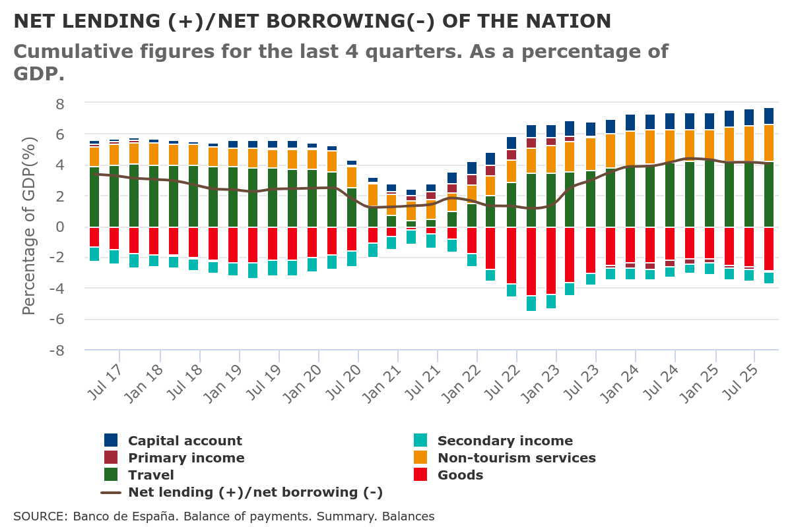
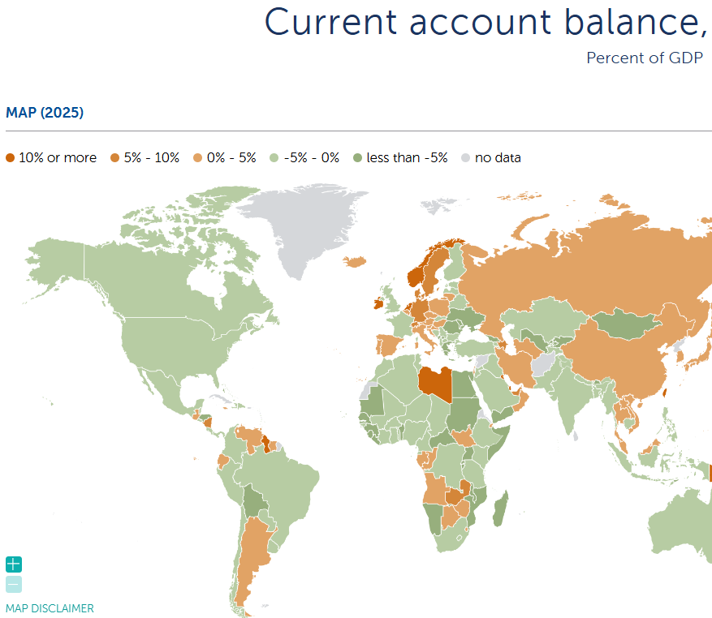
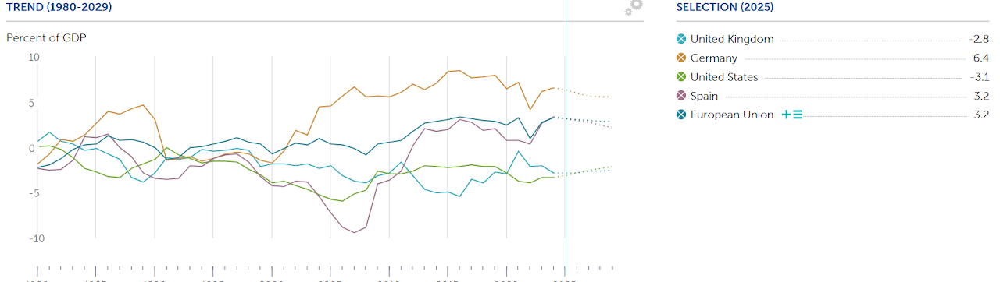

## Theory

Definition: Accounting document that provides a systematic record of economic transactions that occurred during a given period of time between residents of a country and residents of the rest of the world.

 
- Accounting: double entry
- Systematic: structured
- Transactions:  Real and financial &  With or without compensation
- Between residents and non-residents: Domestic
- Time period – Flow variable (vs stock Internations Investmen Position)

### Estructure 

·        Current Account (CC)

  o   Goods (income X)

  o   Services (income X)

  o   Primary Income (factor income) Income (remuneration of domestic production factors abroad) and expenditures (remuneration of foreign production factors in the country):

        Investment income

        Employee compensation

  o   Secondary Income (current transfers) Accounting counterpart of real and/or financial movements, whether voluntary or obligatory, that do not imply a consideration in goods and/or services. (income: transfers received, expenses: transfers made)

        Workers' remittances

        Others

·        Capital account : Capital transfers and operations on non-produced non-financial assets

·        Financial Account (FA) Records all transactions related to the transfer of ownership of financial assets and liabilities of the economy to the rest of the world.

  o   Direct investment (participation greater than 10%)

  o   Portfolio investment (stocks)

  o   Others (Deposits, commercial credits)

  o   Reserve assets

·        Errors and omissions: This account should be interpreted as a balance or statistical discrepancy account that compensates the rest. A positive sign is interpreted as an unrecorded income and, in the opposite case, as an expense.

<iframe src="/assets/HTML/1_2_BP.html" style="width:110%;height:620px;" loading="lazy"></iframe>

### Balances

·   Trade balance

·   G&S Balance

·   The current account balance reflects what happens with the Savings-Investment relationship of an economy.

·   Liquid assets balance (reserves)

Net Lending/Borrowing Position (NLBP) = Current Account+Capital Account = Financial Account (including Reserves)−Errors and Omissions (E&O)

###Interpretations:

1 C/C deficit ➡️ the sum of X-M + RPN + RSN is negative

		RNBD = GDP + RPN + RSN = FC + GCF + X -M + RPN + RSN

		RNBD = FC + Savings (Gross National Savings)

		FC + Savings = FC + GCF + X -M + RPN + RSN ⏩ Savings - GCF = X -M + RPN + RSN ⏩ Savings - Investment = C/C balance

2 C/C deficit ➡️Expenditure (absorption) greater than disposable income

		Absorption = FC+FBC = Domestic demand or Domestic expending

		RNBD - Absorption = X -M + RPN + RSN = C/C balance

3 C/C deficit ➡️ Investment > Savings If savings are greater than investment there will be a surplus in C/C

    ➡️ Differences between public and private savings and investment 

4 C/C deficit ➡️ Net International Investment Position changes: Increase in the debtor position or  Decrease in creditor position.

The International Investment Position (IIP) is a financial metric that summarizes a country's external assets and liabilities at a given point in time. It reflects the net financial position of a country with the rest of the world, indicating whether it is a net creditor or a net debtor. 

## Data

{ width="50%" }

[External statistics • BdE](https://www.bde.es/webbe/en/estadisticas/temas/estadisticas-exteriores.html)
[ank of Spain - Statistical Bulletin - Chapter 17 -  Balance of payments and international investment position](https://www.bde.es/webbe/en/estadisticas/otras-clasificaciones/publicaciones/boletin-estadistico/capitulo-17.html)

pendiente incorporar https://www.ecb.europa.eu/press/calendars/statscal/ext/html/stprbp.en.html

[Source: Euro area monthly balance of payments: November 2024](https://www.ecb.europa.eu/press/stats/bop/2025/html/ecb.bp250117~ce1c7226d7.en.html) 
[Balance of payments and international investment position](https://www.ecb.europa.eu/stats/balance_of_payments_and_external/balance_of_payments/html/index.en.html)

{ width="50%" }
{ width="50%" }
{ width="50%" }

<iframe src="https://data.worldbank.org/share/widget?indicators=BN.CAB.XOKA.CD&view=map" width='450' height='300' frameBorder='0' scrolling="no" ></iframe>
Source WB 
https://data.worldbank.org/indicator/BN.CAB.XOKA.CD?view=map

Source: [IMF World Economic Outlook (October 2024) - Current account balance, percent of GDP](https://www.imf.org/external/datamapper/BCA_NGDPD@WEO/ESP)

IMF [Balance of Payments and International Investment Position - BOP/IIP Home - IMF Data](https://data.imf.org/?sk=7a51304b-6426-40c0-83dd-ca473ca1fd52) (with country data)

USA: [U.S. Direct Investment Abroad: Balance of Payments and Direct Investment Position Data | U.S. Bureau of Economic Analysis (BEA)  / BEA Interactive Data Application](https://www.bea.gov/international/di1usdbal)

UK: [Balance of payments - Office for National Statistics](https://www.ons.gov.uk/economy/nationalaccounts/balanceofpayments) 

  <iframe
    src="/assets/HTML/1_2_exer_BP1.html"
    style="width:100%; height:350px; border:0; transform:scale(0.7); display:block;"
    loading="lazy"></iframe>

  <iframe
    src="/assets/HTML/1_2_exer_BP2.html"
    style="width:100%; height:670px; border:0; transform:scale(0.7); display:block;"
    loading="lazy"></iframe>

  <iframe
    src="/assets/HTML/1_2_exer_BP3.html"
    style="width:100%; height:350px; border:0; transform:scale(0.7); display:block;"
    loading="lazy"></iframe>

  <iframe
    src="/assets/HTML/1_2_exer_BP4.html"
    style="width:100%; height:750px; border:0; transform:scale(0.7); display:block;"
    loading="lazy"></iframe>

## Glossary

- CA / Current Account: Part of a country's balance of payments that tracks the trade of goods and services, income from abroad, and current transfers, reflecting the nation's net income.
- Goods Balance (Exports Revenues X - Imports Payments M): The trade balance of goods, reflecting income from exported goods.
- Services (Exports Revenues X - Imports Payments M): The balance of services, showing income from services provided abroad.
- NPI: Net Primary Income (Factor Income): Records income and expenses related to the remuneration of production factors, including:
  - Investment Income: Earnings from foreign investments, such as dividends, interest, and profits.
  - Employee Compensation: Wages and salaries received by residents working abroad and paid to foreign workers in the country.
- NSI - Net Secondary Income (Current Transfers): Accounting counterpart of real and/or financial movements that do not involve compensation in goods or services, either voluntary or mandatory. It includes:
  - Workers' Remittances: Money sent by migrant workers to their home country.
  - Other Transfers: Other types of current international transfers.
- KA - Capital Account: Records capital transfers and transactions involving non-produced, non-financial assets. It includes:
- Capital Transfers: International transactions that involve changes in ownership of fixed assets or debt forgiveness.
- Operations on Non-Produced, Non-Financial Assets: Includes sales or acquisitions of patents, copyrights, trademarks, and land used by embassies.
- FA - Financial Account: A component of a country's balance of payments that records transactions involving financial assets and liabilities with the rest of the world, including investments and loans. 
- FDI - Foreing Direct Investment: Foreign investment involving ownership of at least 10% in a company.
Portfolio Investment: Investments in financial securities, such as stocks and bonds, that do not confer significant control over the company.
- Other Investments: Includes commercial loans, deposits, and other financial assets that do not fall under direct or portfolio investment.
- Reserve Assets: Foreign currency reserves and other highly liquid assets held by central banks to manage exchange rate stability and financial crises.
- E&O - Errors and Omissions: It serves as a balancing or statistical discrepancy account.. A positive balance indicates unrecorded inflows, while a negative balance suggests unrecorded outflows.
- NLBP - Net Lending/Borrowing Position: Indicates whether an economy is a net lender (surplus) or net borrower (deficit) to the rest of the world, based on the balance of its financial transactions.

## Exercise

1. Comment the balance of payment of one country.

2. Take a look of the Current Account balance of a contry and see what happend with the International Invesment Position. Comment

-----------------------
